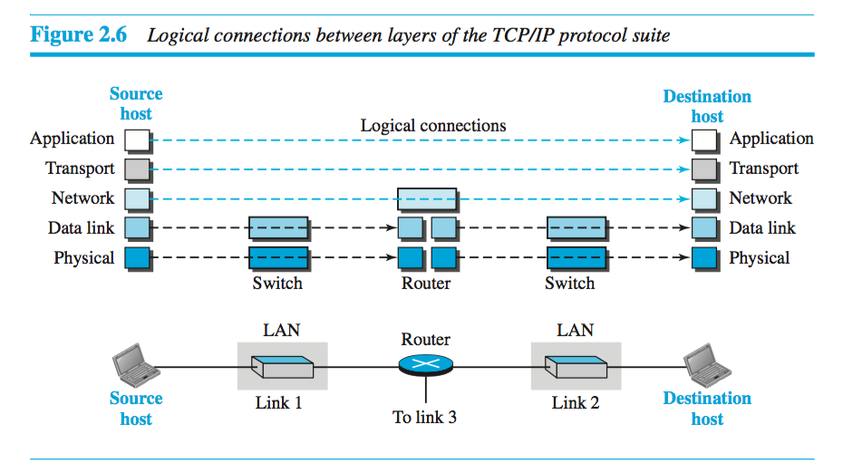
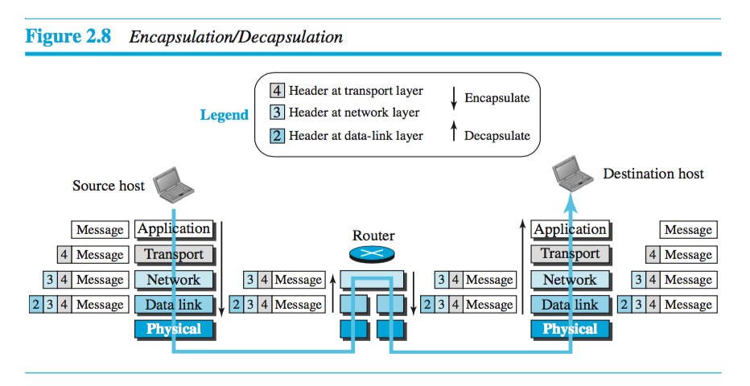
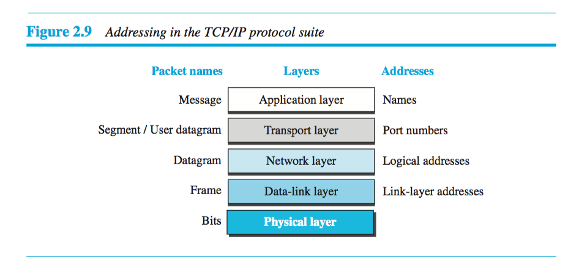

# Chapter 2 - Network Models

## Protocol Layering
Protocols are layered, each layer having its own set of functions, which makes it easy to design each protocol layer independantly. Makes designing and modifying the overall protocol much easier.

## TCP/IP Protocol Suite
The TCP/IP Protocol Suite is the computer networking model and set of communications protocols used on the Internet and similar computer networks. TCP/IP is used for the name because TCP/IP Protocols are the most important protocols in the suite.

*Encapsulation* begins at the application layer, passes it to the transport layer which adds it's header, then to network which adds its header, and so forth. Then when data gets to the destination, each layer removes (*decapsulates*) its header info until it gets to the application layer. Figure 2.8 on page 41 visualizes encapsulation well.

*Addressing*  Every time data moves from hop

### TCP/IP Layers

1. Application

2. Transport

3. Network:

4. Data link: The data-link layer is responsible for moving a frame through the link that the router has chosen.

5. Physical: In charge of moving bits from hop to hop. Functions include conversion of bits to signal, synchronizing bits, transmitting the signal, knows how to use the active physical topology, figures out the line configuration, etc.

### Logical Connections

The connections between layers is show logically in the following diagram. Notice that the switches touch two layers and the router touches three. This implies the first three layers data packets should not be changed with any router or link layer switch.

### Encapsulation/Decapsulation

Data is encapsulated and called something different depending on the layer.

Starting at the source...

1. At application layer encapsulates data as a _message_ and generally does not add a header.
2. Next at the transport layer, a header is added and its called a _user datagram_.
3. At the network layer, a header is added and it is called a _datagram_.
4. At the data-link layer, a header is added and its called a _frame_.

Now at the router...

1. After the set of bits are delivered to the data-link layer, this layer decapsulates the datagram from the frame and passes it to the network layer.
2. At the network layer in the router the data is only inspected (barring any fragmentation issues).
3. Now the data re-encapsulates at the data link layer and passes to physical layer for transmission.

Now at the destination...

At the destination host, each layer only decapsulates the packet received, removes the payload, and delivers the payload to the next-higher layer protocol until the message reaches the application layer. It is necessary to say that decapsulation in the host involves error checking.

### Addressing

As the payload is making its way through the layers and their protocols, various address types are used. At application layer, Names are used. At transport layer, port numbers are used. At network layer, logical addresses are used. At data-link layer, link-layer addresses are used.

