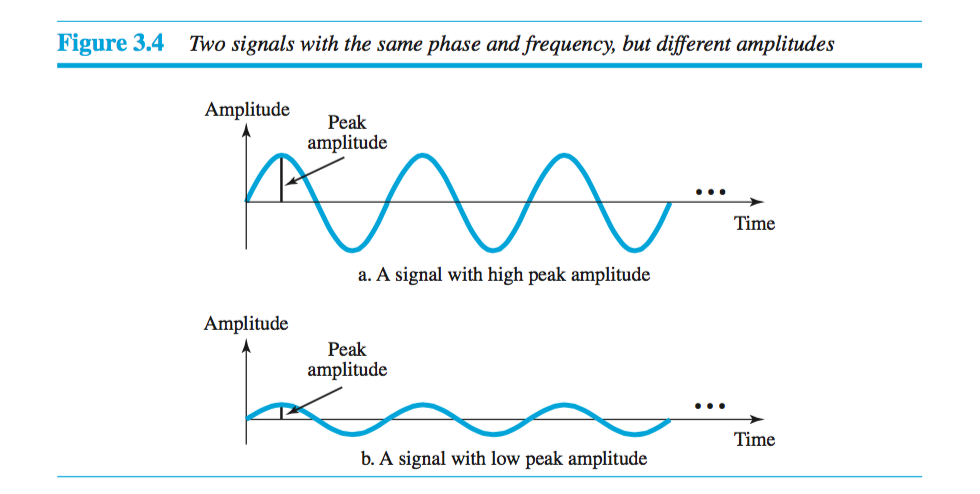
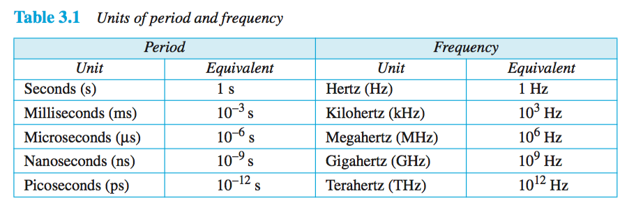

# Chapter 3 - The Physical Layer

##  Data and Signals

### Analog and Digital Signals

**Analog data**, such as the sounds made by a human voice, take on continuous values. When someone speaks, an analog wave is created in the air. This can be captured by a microphone and converted to an analog signal or sampled and converted to a digital signal.

**Digital data** take on discrete values. For example, data are stored in computer memory in the form of 0s and 1s. They can be converted to a digital signal or modu- lated into an analog signal for transmission across a medium.

### Periodic Analog Signals

Periodic analog signals can be classified as simple or composite. A simple periodic analog signal, a **sine wave**, cannot be decomposed into simpler signals. A composite periodic analog signal is composed of multiple sine waves.

#### Amplitude

The peak amplitude of a signal is the absolute value of its highest intensity, propor- tional to the energy it carries. For electric signals, peak amplitude is normally measured in volts.

#### Period and frequency

**Period** refers to the amount of time, in seconds, a signal needs to complete 1 cycle. **Frequency** refers to the number of periods in 1 s. Note that period and frequency are just one characteristic defined in two ways. Period is the inverse of frequency, and frequency is the inverse of period, as the following formulas show.

	ƒ=1/T   and    T=1/ƒ

The units of period and frequency are detailed in the following table.

#### Phase

The **phase** of an oscillation or wave refers to a sinusoidal function such as the following:

#### Wavelength

**Wavelength** is another characteristic of a signal traveling through a transmission medium. Wavelength binds the period or the frequency of a simple sine wave to the propagation speed of the medium.

### Signal Impairment

#### Attenuation and amplification

Attenuation is the loss of signal energy to heat. The following equations can be used to determine how much energy is lost.

	P = Pout/Pin, where P is Power in milli-Watts

	dBm = 10 * log(Pout/Pin), where dBmh is Attentuation in decibal-milliwats

##### Example Problems

1. given Pmw = 2000, find dBm?
    * result = (10 log((2000 mW)/(0.001 W)) dBm)/(log(10)) = **33.01**

2. given dBm = 25, find Pmw?
    * 10^((25 dBm)/(10 dBm)) = **316.2**

#### Distortion

Distortion is when there is a change to the form of a signal. The Phase is affected.

#### Noise

Noise is anything that is affecting your signal in an unwanted way. The signal to noise ratio is one of the most important elements to signals.

#### Signal to Noise Ratio

Signal-to-noise ratio is defined as the ratio of the power of a signal (meaningful information) and the power of background noise (unwanted signal):

	SNR = ave-signal-power/ave-noise-power

Often SNR is expressed in dB, so...

  SNR_dB = 10*log_10(SNR)

##### Example Problems

1. The power of a signal is 10 mW and the power of the noise is 1 μW; what are the values of SNR and SNRdB?
    * SNR = (10,000 mw) / (1 mw) = 10,000
    * SNRdB = 10 log10(10,000) = 10*log10(104) = 40

#### Wavelength

  Wavelength = (propagation-speed)*period = (propagation-speed)/frequency

